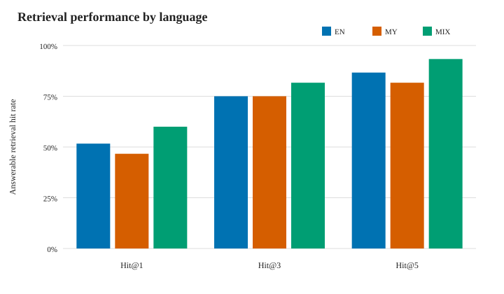
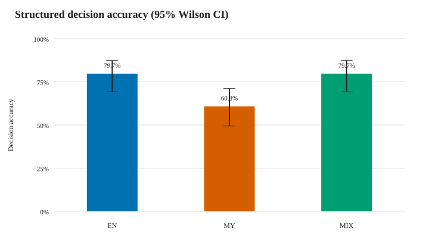
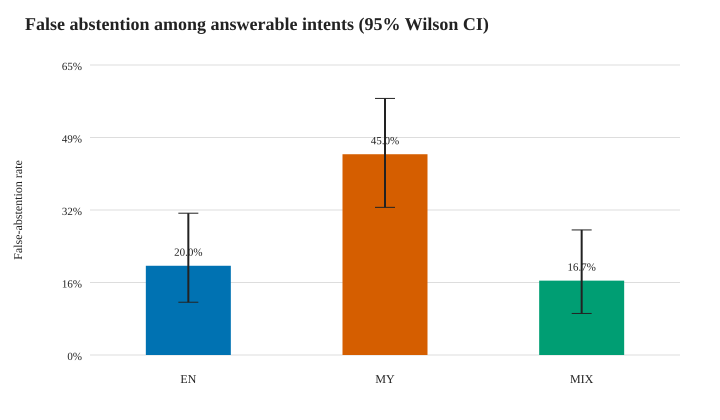
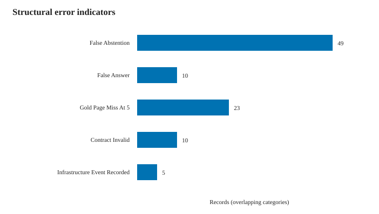

# Evaluating Retrieval and Abstention across Burmese, English, and Code-Mixed Queries in RAG for University Academic Regulations

## Abstract

Retrieval-augmented generation (RAG) systems used for university regulations must answer supported questions while abstaining when evidence is unavailable. This work presents a controlled evaluation of a local RAG pipeline over a frozen University of Information Technology academic-regulation corpus under English (EN), Burmese (MY), and Burmese-English code-mixed (MIX) queries. The benchmark contains 79 semantic intents and 237 variants; five intents (15 variants) form a development set, while 74 intents (222 variants) are held out. Retrieval uses `intfloat/multilingual-e5-small` embeddings and cosine similarity through a normalized FAISS `IndexFlatIP`, with the top five chunks supplied to `gemma3:4b-it-q4_K_M`. On 180 answerable held-out variants, overall Hit@1, Hit@3, Hit@5, and mean reciprocal rank were 52.78%, 77.22%, 87.22%, and 0.6577. Structured answer-versus-abstain decision accuracy was 73.42%. Paired analysis showed a language-condition difference in decision correctness (`Q(2)=10.595`, `p=0.0050`), with MY accuracy (60.81%) below EN and MIX (both 79.73%). This difference was associated with a higher MY false-abstention rate (45.00%) than EN (20.00%) or MIX (16.67%). Retrieval Hit@k differences were not statistically significant. The output contract was valid for 95.50% of records. Because qualified independent semantic reviewers were unavailable, semantic answer correctness, groundedness, hallucination, and claim-level citation support were not evaluated. The findings therefore characterize retrieval, structured abstention behavior, contract compliance, and local-system reliability rather than end-to-end semantic answer quality.

**Keywords:** retrieval-augmented generation, Burmese, code mixing, abstention, university regulations, multilingual retrieval, reliability

## 1. Introduction

University regulations contain consequential information about academic credits, registration, examinations, progression, and degree requirements. A RAG system can provide students with accessible natural-language interaction while constraining responses to institutional evidence. Reliability, however, requires more than retrieving a plausible passage. The system must decide when the supplied evidence supports an answer, abstain when it does not, preserve language expectations, and cite the evidence it used.

Burmese presents additional evaluation challenges. Standard Burmese, Burmese containing English academic terminology, and explicitly code-mixed questions may interact differently with multilingual embedding models and instruction-following generators. Aggregate evaluation can obscure these differences, particularly when variants express the same semantic intent. A paired design is therefore needed so that language conditions are compared within the same underlying information need.

This study evaluates a reproducible, local RAG configuration for University of Information Technology (UIT) academic regulations. It separates retrieval evaluation from structured answer-versus-abstain behavior and deterministic output-contract validation. The study addresses three questions:

1. How effectively does the frozen multilingual retriever return gold-page evidence for answerable EN, MY, and MIX questions?
2. How accurately does the generator choose `ANSWER` or `ABSTAIN` across the three language conditions?
3. Which reproducible structural failure patterns account for observed language-condition differences?

The work contributes a frozen university-domain benchmark design, a reproducible local retrieval and generation pipeline, paired multilingual statistical analysis, and a transparent accounting of contract and infrastructure failures. It does not claim to be the first Burmese RAG benchmark. Because human semantic annotation could not be completed, it also does not report held-out hallucination or groundedness rates. This distinction is essential: valid structure and citation syntax are not substitutes for semantic correctness.

## 2. Related Work

RAG combines parametric generation with retrieved non-parametric evidence [1]. Its evaluation is consequently multi-stage: retrieval quality, faithful use of retrieved context, and generation quality should be assessed separately [3]. This separation motivates the present study's distinct reporting of page-based retrieval, structured answer-versus-abstain decisions, and deterministic output-contract validity.

The retriever uses multilingual E5, a family trained for multilingual text embedding with small, base, and large model variants [2]. Multilingual retrieval and generation nevertheless remain sensitive to language condition. Code mixing can create competing effects between cross-lingual representation alignment and the query-passage matching objective [4]. In multilingual RAG, retrievers and generators may also exhibit language preferences, and retrieval improvements do not necessarily yield corresponding generation improvements [5]. These findings motivate paired EN, MY, and MIX variants of the same semantic intents rather than comparisons over unrelated questions. They do not, however, establish the direction of Burmese-specific effects in advance.

Abstention is increasingly treated as a distinct LLM reliability behavior with its own methods, benchmarks, and metrics [6]. Selective abstention has also been studied as a response to insufficient or misaligned knowledge [7]. The present work does not train an abstention mechanism; it evaluates the frozen generator's structured `ANSWER`/`ABSTAIN` decision against benchmark answerability labels.

RAG hallucination and evidence-coverage errors require explicit semantic detection or annotation [8]. Therefore, mechanical citation validity and contract compliance are not interpreted here as hallucination measurements. This boundary is particularly important because independent semantic annotation was unavailable. The study makes no priority claim and is positioned only as a focused Burmese university-domain RAG reliability study.

## 3. Dataset and Scope

### 3.1 Source corpus

The experiment uses publicly accessible UIT academic-regulation material derived from the official UIT website. The frozen source is a 24-page academic-credits document whose original language is Burmese with English academic terms. The retrieval corpus version `UIT-AC-v1.1` contains 148 chunks covering pages 4 through 24. Source text, chunk identifiers, page metadata, and hashes were frozen before held-out generation.

The corpus represents one official source document rather than the entire UIT website. Results must therefore be interpreted as a focused university academic-regulation study, not as coverage of all UIT regulations or announcements.

### 3.2 Benchmark

The benchmark contains 79 semantic intents, each represented by EN, MY, and MIX variants, for 237 questions in total. There are 189 answerable and 48 unanswerable variants. Five semantic intents (`Q002`, `Q008`, `Q024`, `Q029`, and `Q057`) were frozen as development data, producing 15 development variants: 9 answerable and 6 unanswerable.

All remaining 74 intents form the held-out test set. The test set contains 222 variants: 180 answerable, 42 unanswerable, and exactly 74 variants per language condition. No development record was included in held-out retrieval, generation, statistics, or error analysis.

| Split | Intents | Variants | Answerable | Unanswerable | EN/MY/MIX |
|---|---:|---:|---:|---:|---:|
| Development | 5 | 15 | 9 | 6 | 5/5/5 |
| Held-out | 74 | 222 | 180 | 42 | 74/74/74 |
| Total | 79 | 237 | 189 | 48 | 79/79/79 |

## 4. Methodology

### 4.1 Retrieval

Chunk text is embedded with `intfloat/multilingual-e5-small` using the E5 passage prefix `passage: `. Queries use the prefix `query: `. Vectors are normalized to `float32`, and cosine similarity is implemented through inner-product search using FAISS `IndexFlatIP`. The retriever returns exactly five chunks per question.

Gold evidence is represented as pages. A retrieved chunk is counted as relevant when any page in its metadata page list intersects the parsed gold-evidence pages. Hit@1, Hit@3, Hit@5, and mean reciprocal rank (MRR) are calculated only for answerable questions. Unanswerable rows retain retrieval scores and Top-5 evidence but do not receive Hit or MRR values.

### 4.2 Generation

Generation uses the local Ollama model `gemma3:4b-it-q4_K_M` with prompt version `uit-context-only-json-v3` and parser version `uit-citation-object-parser-v3`. The CPU-safe resource profile uses `num_ctx=4096`, `num_predict=512`, temperature 0, `top_p=0.9`, `top_k=40`, and seed 42. Requests are sequential, with `OLLAMA_NUM_PARALLEL=1` and `OLLAMA_MAX_LOADED_MODELS=1`.

Each prompt contains the frozen question and the exact retrieved Top-5 chunks. Evidence blocks explicitly bind a chunk identifier to its page list. The structured output must contain a decision (`ANSWER` or `ABSTAIN`), an answer, and citations. `ANSWER` requires at least one citation that matches a supplied chunk-page pair. `ABSTAIN` requires no citation and is separately checked against the deterministic English abstention response. Each completed record is checkpointed immediately. Transient infrastructure failures may receive one bounded retry; parsing, citation, semantic, and output-validation failures are not retried.

### 4.3 Evaluation boundaries

The frozen answerability label determines the expected structured decision: `ANSWER` for answerable variants and `ABSTAIN` for unanswerable variants. Treating `ABSTAIN` as the positive decision, the analysis reports accuracy, abstention precision, recall, and F1.

Two qualified independent Burmese reviewers were planned but were unavailable. A prospective versioned waiver therefore restricts held-out reporting to automated non-semantic measures. Semantic answer correctness, numeric correctness, groundedness, hallucination, claim-level citation support, nuanced language consistency, and causal failure attribution are marked `NOT_EVALUATED`. Blank reviewer templates remain unmodified.

### 4.4 Statistical analysis

EN, MY, and MIX variants of an intent are paired rather than independent observations. Binary language-condition outcomes are compared using Cochran's Q. Pairwise comparisons use two-sided exact McNemar tests with Holm adjustment within each outcome. Proportions use two-sided 95% Wilson score intervals. The family-wise significance threshold is 0.05. The 60 answerable intents form the paired retrieval and false-abstention population; the 14 unanswerable intents form the false-answer population.

## 5. Results

### 5.1 Retrieval performance

| Language | Hit@1 | Hit@3 | Hit@5 | MRR |
|---|---:|---:|---:|---:|
| Overall | 52.78% | 77.22% | 87.22% | 0.6577 |
| EN | 51.67% | 75.00% | 86.67% | 0.6444 |
| MY | 46.67% | 75.00% | 81.67% | 0.6039 |
| MIX | 60.00% | 81.67% | 93.33% | 0.7247 |

MIX had the highest observed retrieval values and MY the lowest, but paired omnibus comparisons were not significant for Hit@1 (`p=0.2564`), Hit@3 (`p=0.5529`), or Hit@5 (`p=0.0990`). No pairwise retrieval comparison remained significant after Holm adjustment.

### 5.2 Structured decision performance

The generator produced 141 `ANSWER` and 81 `ABSTAIN` decisions. The confusion matrix was:

| Frozen label / decision | ANSWER | ABSTAIN |
|---|---:|---:|
| Answerable | 131 | 49 |
| Unanswerable | 10 | 32 |

Decision accuracy was 163/222 (73.42%). Abstention precision was 32/81 (39.51%), recall was 32/42 (76.19%), and F1 was 52.03%.

Language-specific decision accuracy was 59/74 for EN (79.73%, 95% CI 69.21%-87.31%), 45/74 for MY (60.81%, 49.42%-71.14%), and 59/74 for MIX (79.73%, 69.21%-87.31%). Cochran's Q indicated a language-condition difference, `Q(2)=10.595`, `p=0.0050`. Holm-adjusted exact McNemar comparisons were significant for EN versus MY (`p=0.0376`) and MY versus MIX (`p=0.0376`), but not EN versus MIX (`p=1.0000`).

### 5.3 False abstention and false answer

Among the 60 answerable intents per condition, false-abstention rates were 12/60 for EN (20.00%), 27/60 for MY (45.00%), and 10/60 for MIX (16.67%). The paired difference was significant, `Q(2)=16.188`, `p=0.00031`. MY exceeded EN by 25.00 percentage points (Holm-adjusted `p=0.01185`) and MIX by 28.33 points (`p=0.00146`). EN and MIX did not differ (`p=0.7905`).

Among 14 unanswerable intents per condition, false-answer rates were 3/14 for EN, 2/14 for MY, and 5/14 for MIX. The paired comparison was not significant (`p=0.2466`). Wide Wilson intervals reflect the small unanswerable population; nonsignificance is not evidence of equivalence.

### 5.4 Contract and system reliability

The output contract was valid for 212/222 records (95.50%). Ten records retained frozen citation/contract validation failures. Exact deterministic abstention wording was satisfied by 78/81 abstentions (96.30%), while 134/141 `ANSWER` outputs passed mechanical validation (95.04%). Five records retained an infrastructure-event flag associated with a model-runner stop. All 222 records remained in the intent-to-treat analysis.

Mean total runtime was 69.06 seconds per record (median 65.82; range 32.56-127.55), with an aggregate runtime of approximately 4.26 hours. Prompt length ranged from 731 to 1,795 tokens, within the frozen 4,096-token context allocation together with the 512-token generation allowance.

### 5.5 Structural error patterns

The structural inventory contained 49 false abstentions, 10 false answers, 23 answerable Hit@5 misses, 10 contract-invalid records, and five records with an infrastructure-event flag. These nonexclusive flags affected 77 unique variants; 20 variants had multiple flags.

Of the 49 false abstentions, 34 coincided with a Top-5 gold-page intersection and 15 with a miss. At the intent level, 37/74 intents had different EN/MY/MIX decisions. The most frequent disagreement was EN=`ANSWER`, MY=`ABSTAIN`, MIX=`ANSWER`, observed for 17 intents. MY falsely abstained while both paired EN and MIX decisions were correct for 16 intents.

## 6. Discussion

The main result is a divergence between retrieval and structured decision behavior. Although MIX had the highest observed retrieval rates, paired Hit@k differences did not reach statistical significance. In contrast, structured decision correctness differed significantly, with MY producing substantially more false abstentions than EN or MIX. This suggests that retrieval rank alone does not explain the observed language-conditioned behavior.

The structural contingency analysis sharpens this observation without making a semantic causal claim. Nineteen MY false abstentions occurred alongside an automated Top-5 gold-page match, compared with seven for EN and eight for MIX. A page match does not establish that the retrieved text was sufficient or well aligned with the question; consequently, these cases cannot be labelled generation failures without semantic review. They nevertheless identify a bounded set of records for future investigation.

The abstention results show a reliability trade-off. Recall of unanswerable cases was relatively high, but abstention precision was low because many answerable variants were rejected. For a student-facing system, false answers may expose users to unsupported information, while false abstentions reduce usefulness. The preferred operating point depends on deployment risk and cannot be selected from this held-out set without violating the frozen no-tuning policy.

The contract-validity rate demonstrates that structured output and citation checks can be implemented reliably with a local, resource-constrained model. However, contract validity says only that an output followed deterministic structural requirements. It does not prove that every claim is correct or grounded.

## 7. Limitations

First, qualified independent semantic reviewers were unavailable. The study therefore cannot estimate held-out semantic answer correctness, groundedness, hallucination, numeric correctness, or claim-level citation support. The revised title consequently names retrieval and abstention—the outcomes evaluated directly—rather than implying that a hallucination rate was measured.

Second, the corpus is a single UIT academic-credits source rather than the full university website. Results may not generalize to other regulations, institutions, document layouts, or domains. Third, the benchmark contains only 14 unanswerable semantic intents, limiting precision and statistical power for false-answer comparisons. Fourth, evaluation uses one embedding model, one generator, and one frozen prompt/resource configuration; it is not a model-comparison study. Fifth, gold evidence is page based. Page intersection is reproducible but less precise than claim-level evidence annotation. Finally, generation used CPU-only local inference, and observed runtime may not generalize to other hardware.

## 8. Ethical and Reproducibility Considerations

Only publicly accessible official UIT material was included in the frozen experiment. Personal, authentication-protected, unofficial, and unrelated information was excluded. The system should not be deployed as an authoritative substitute for official regulations. Users must be directed to the source when decisions have academic consequences.

Corpus, benchmark, split, index, prompt, parser, resource profile, model digest, generation outputs, analysis protocols, result tables, and figures are versioned and hashed. Development and held-out sets are separated by semantic intent. Held-out observations were not used to tune the frozen configuration. Validation failures and infrastructure events remain included rather than being regenerated or silently removed.

## 9. Conclusion

This study evaluated a frozen local RAG pipeline across paired English, Burmese, and Burmese-English code-mixed university-regulation queries. Retrieval reached Hit@5 of 87.22% overall on answerable held-out variants, with no statistically significant paired language difference in Hit@k. Structured decision accuracy was 73.42%, and MY showed significantly lower decision correctness due primarily to a higher false-abstention rate. The system achieved 95.50% deterministic contract validity under CPU-only inference.

The results demonstrate the importance of evaluating retrieval, abstention, output contracts, and language conditions separately. They do not establish semantic answer quality or hallucination performance. Future work should complete qualified independent semantic annotation, broaden the official university corpus, increase unanswerable coverage, and evaluate whether the observed MY abstention pattern persists across models and institutions without tuning on the present held-out set.

## References

[1] P. Lewis et al., “Retrieval-Augmented Generation for Knowledge-Intensive NLP Tasks,” in *Advances in Neural Information Processing Systems*, vol. 33, 2020, pp. 9459–9474.

[2] L. Wang, N. Yang, X. Huang, L. Yang, R. Majumder, and F. Wei, “Multilingual E5 Text Embeddings: A Technical Report,” arXiv:2402.05672, 2024, doi: 10.48550/arXiv.2402.05672.

[3] S. Es, J. James, L. Espinosa Anke, and S. Schockaert, “RAGAs: Automated Evaluation of Retrieval Augmented Generation,” in *Proc. 18th Conf. European Chapter of the Association for Computational Linguistics: System Demonstrations*, 2024, pp. 150–158, doi: 10.18653/v1/2024.eacl-demo.16.

[4] J. Do, J. Lee, and S.-w. Hwang, “ContrastiveMix: Overcoming Code-Mixing Dilemma in Cross-Lingual Transfer for Information Retrieval,” in *Proc. 2024 Conf. North American Chapter of the Association for Computational Linguistics: Human Language Technologies, Volume 2 (Short Papers)*, 2024, pp. 197–204, doi: 10.18653/v1/2024.naacl-short.17.

[5] J. Park and H. Lee, “Investigating Language Preference of Multilingual RAG Systems,” in *Findings of the Association for Computational Linguistics: ACL 2025*, 2025, pp. 5647–5675, doi: 10.18653/v1/2025.findings-acl.295.

[6] B. Wen, J. Yao, S. Feng, C. Xu, Y. Tsvetkov, B. Howe, and L. L. Wang, “Know Your Limits: A Survey of Abstention in Large Language Models,” *Transactions of the Association for Computational Linguistics*, vol. 13, pp. 529–556, 2025, doi: 10.1162/tacl_a_00754.

[7] L. Huang et al., “Alleviating Hallucinations from Knowledge Misalignment in Large Language Models via Selective Abstention Learning,” in *Proc. 63rd Annual Meeting of the Association for Computational Linguistics, Volume 1 (Long Papers)*, 2025, pp. 24564–24579, doi: 10.18653/v1/2025.acl-long.1199.

[8] T. A. Chang, K. Tomanek, J. Hoffmann, N. Thain, E. MacMurray van Liemt, K. Meier-Hellstern, and L. Dixon, “Detecting Hallucination and Coverage Errors in Retrieval Augmented Generation for Controversial Topics,” in *Proc. 2024 Joint International Conference on Computational Linguistics, Language Resources and Evaluation*, 2024, pp. 4729–4743.
